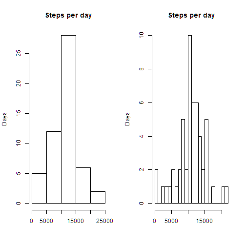
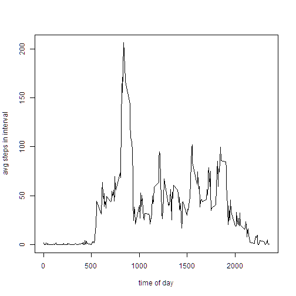
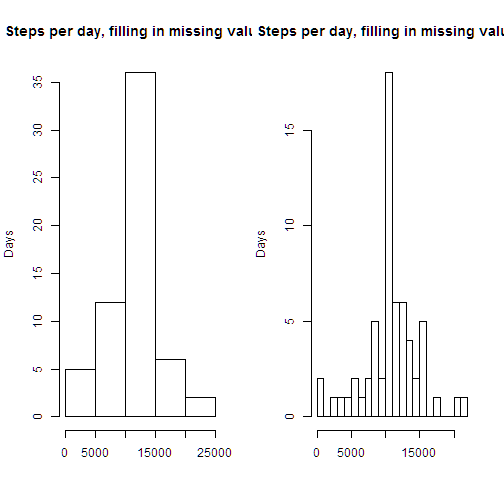
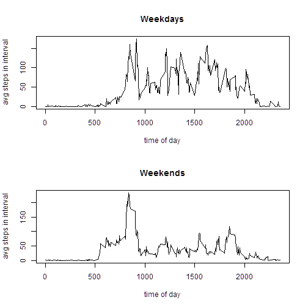

# Reproducible Research: Peer Assessment 1
================================================================================

## Loading and preprocessing the data

I ran this in R gui 3.1.1, rather than Rstudio, using the command line
knit2html and browseURL, as Peng described in the lecture. I doubt that
this matters, though it might explain why my summary() command shows
one thing on the screen and another thing in the .html file, as discussed
below.

We assume you are (your current working directory is)
in the github repository, which includes this file. Therefore,
the following works:


```r
d1 <- read.csv(unz("activity.zip","activity.csv"))
d1Clean <- d1[!is.na(d1$steps),]
```

Since we know from the instructions the number of observations,
we check that there are the correct number of rows:


```r
str(d1)
```

```
## 'data.frame':	17568 obs. of  3 variables:
##  $ steps   : int  NA NA NA NA NA NA NA NA NA NA ...
##  $ date    : Factor w/ 61 levels "2012-10-01","2012-10-02",..: 1 1 1 1 1 1 1 1 1 1 ...
##  $ interval: int  0 5 10 15 20 25 30 35 40 45 ...
```

and this shows that there are 17568 rows of data.

We then removed the NA's, of which there are 2304 values.
We call the first data frame d1, and the second d1Clean.

## What is mean total number of steps taken per day?

We have two steps: first get the total number of steps taken each day.
Then take the averages.

I'm a fan of avoiding packages if there's a basic way to do something.
One way to do this is to use the "aggregate" function:


```r
dailyTotals <- aggregate(d1Clean$steps,by=list(d1Clean$date),sum)
colnames(dailyTotals) <- c("date","steps")
```
But why are there only 53 dates with totals,
when the data set has 61 dates?
The answer is that there are some dates with no non-NA values - the
clean data set d1Clean has only 53 dates.

We can draw a histogram, two different ways for fun:

```r
par(mfrow=c(1,2))
hist(dailyTotals$steps,
        main="Steps per day",
        ylab="Days", xlab=NULL)
hist(dailyTotals$steps,
        breaks=20,
        main="Steps per day",
        ylab="Days", xlab=NULL)
```

 

which shows far and away the typical day is 15-20 thousand steps,
and that the median is likely to be in the 11,000 range.
Of course we should be curious about the day or days on the very left,
on which there was almost no movement at all. The minimum, below,
is a mere 41! Not believable, unless perhaps
our subject were hospitalized.

The finer histogram columns, on the right, show that
while this is vaguely bell-shaped, it's pretty fat-tailed.
Removing the outlier, and increasing the number of days, we could probably
get away with modeling this as a normal variable.

(Curiously,fig.height and fig.width made it *worse* (i.e. way skinny
or with unreadable titles) as in r histogram, fig.width=4,fig.height=30.
Evaluators, can you suggest anything?

The basic R function "summary" gives is *supposed to* give
us the mean and median:

```r
summary(dailyTotals$steps)
```

```
##    Min. 1st Qu.  Median    Mean 3rd Qu.    Max. 
##      41    8840   10800   10800   13300   21200
```
showing a mean of 10766
and a median of 10765
which are pretty close. Well, it's **supposed** to show that - it's
actually rounding to 10800. What if we try

```r
summary(dailyTotals$steps,digits=5)
```

```
##    Min. 1st Qu.  Median    Mean 3rd Qu.    Max. 
##      41    8841   10765   10766   13294   21194
```
instead? This teaches me that *knit2html doesn't
always show what I see when I run the same command in R*.
It must be making up its own mind about rounding or formatting.

While there are options to correct this, I have to know how many 
digits to specify. The result is not so general as one would like.

## What is the average daily activity pattern?

We take the clean data (without the NA's), and we 
use the interval as the factor, and apply aggregate.
This gives us the graph we're looking for:


```r
d1Clean$interval <- as.factor(d1Clean$interval)

hourlyTotals <- aggregate(d1Clean$steps,by=list(d1Clean$interval),mean)
colnames(hourlyTotals) <- c("interval","steps")

plot(hourlyTotals$interval,hourlyTotals$steps,
        type = "l",
        xlab="time of day",
        ylab="avg steps in interval")
lines(hourlyTotals$steps)
```

 

Well this makes sense - our individual goes to bed at night. 
For the life of me, however, I can't make this a line drawing -
the type="l" option is being ignored. No matter what I do,
I can't connect the dots. So my workaround is to add the call to lines,
so the graph looks vaguely correct. Evaluator, can you help?


We are asked to locate the maximum, which we know about where it will lie.
We use the R match function, or the which function:


```r
max(hourlyTotals$steps)
```

```
## [1] 206.2
```

```r
maxLoc1 <- which(hourlyTotals$steps == max(hourlyTotals$steps))
maxLoc2 <- match(max(hourlyTotals$steps),hourlyTotals$steps)
maxLoc1
```

```
## [1] 104
```

```r
maxLoc2
```

```
## [1] 104
```
We see that the 104-th
element of our totals is the maximum, which occurs at interval
hourlyTotals$interval[104], 835.
Wherever this subject goes every day,
they get there about 8:30 or 8:45 in the morning.

## Imputing missing values

As mentioned above, there are 2304 missing values.
The clean data set d1Clean has only 53 dates,
while the raw data has 0 dates.

*To devise a strategy, it is prudent first to look.*

So are they sporadic or do the missing values follow some pattern?
Visusal inspection (in say Excel) shows that all the NA's are on 8 dates,
and those dates have no non-missing values. 
Visual inspection of the 8 dates indicates 
about about 2 are weekends and 6 are weekdays.
Given this pattern, it is curious
that the assignment suggests one method of replacing missing values as
using the average for that date - this average does not exist!

So let's verify this. This should be done with plyr, but I haven't figured
that out yet, so let's do it the hard way:


```r
d2 <- d1
d2$is.na <- is.na(d2$steps)
d2 <- split(d2,d2$date)
results <- data.frame(length(d2),2)
results <- cbind(as.vector(unique(d1$date)),results)
colnames(results) <- c("date","Nr of Obs","NAs")
for(i in 1:length(d2))
     {
        results[i,1] <- d2[[i]]$date[1]
        results[i,2] <- length(d2[[i]]$steps)
        results[i,3] <- sum(d2[[i]]$is.na)
     }
results
```

```
##          date Nr of Obs NAs
## 1  2012-10-01       288 288
## 2  2012-10-02       288   0
## 3  2012-10-03       288   0
## 4  2012-10-04       288   0
## 5  2012-10-05       288   0
## 6  2012-10-06       288   0
## 7  2012-10-07       288   0
## 8  2012-10-08       288 288
## 9  2012-10-09       288   0
## 10 2012-10-10       288   0
## 11 2012-10-11       288   0
## 12 2012-10-12       288   0
## 13 2012-10-13       288   0
## 14 2012-10-14       288   0
## 15 2012-10-15       288   0
## 16 2012-10-16       288   0
## 17 2012-10-17       288   0
## 18 2012-10-18       288   0
## 19 2012-10-19       288   0
## 20 2012-10-20       288   0
## 21 2012-10-21       288   0
## 22 2012-10-22       288   0
## 23 2012-10-23       288   0
## 24 2012-10-24       288   0
## 25 2012-10-25       288   0
## 26 2012-10-26       288   0
## 27 2012-10-27       288   0
## 28 2012-10-28       288   0
## 29 2012-10-29       288   0
## 30 2012-10-30       288   0
## 31 2012-10-31       288   0
## 32 2012-11-01       288 288
## 33 2012-11-02       288   0
## 34 2012-11-03       288   0
## 35 2012-11-04       288 288
## 36 2012-11-05       288   0
## 37 2012-11-06       288   0
## 38 2012-11-07       288   0
## 39 2012-11-08       288   0
## 40 2012-11-09       288 288
## 41 2012-11-10       288 288
## 42 2012-11-11       288   0
## 43 2012-11-12       288   0
## 44 2012-11-13       288   0
## 45 2012-11-14       288 288
## 46 2012-11-15       288   0
## 47 2012-11-16       288   0
## 48 2012-11-17       288   0
## 49 2012-11-18       288   0
## 50 2012-11-19       288   0
## 51 2012-11-20       288   0
## 52 2012-11-21       288   0
## 53 2012-11-22       288   0
## 54 2012-11-23       288   0
## 55 2012-11-24       288   0
## 56 2012-11-25       288   0
## 57 2012-11-26       288   0
## 58 2012-11-27       288   0
## 59 2012-11-28       288   0
## 60 2012-11-29       288   0
## 61 2012-11-30       288 288
```

*So no obvious method of filling in the missing values will really
change much in our analysis.* Any reasonable method of filling in the
missing data will, therefore, not change the mean and median very much.
In fact we would *expect* it **NOT** to.

Nevertheless, an assignment is an assignment, so here we go.
Each day has 288 intervals (24 * 60 / 5),
so we will just take the average steps per day
and fill them in.  Our **R** code might go something like this:

 - use our d2 list of data from directly above, split by date
 - test for NA (if one step is missing, **all** of the intervals are)
 - each day has 288 intervals, so assign the 288 hourlyTotals


```r
for(i in 1:length(d2))
     {
        if(is.na(d2[[i]]$steps[1])) # if one is they all are
            {
                d2[[i]]$steps <- hourlyTotals$steps
            }
     }

# there is surely a better way to to this...
# note that in markdown, a single hash (#) inside the R code
# is just a comment.

d3 <- d2[[1]]
for(i in 2:length(d2))
     {
        d3 <- rbind(d3,d2[[i]])
     }
```

Now we demonstrate that filling in missing values with averages of the other data
really won't change the overall average:


```r
dailyTotalsd3 <- aggregate(d3$steps,by=list(d3$date),sum)
colnames(dailyTotalsd3) <- c("date","steps")

par(mfrow=c(1,2))
hist(dailyTotalsd3$steps,
        main="Steps per day, filling in missing values",
        ylab="Days", xlab=NULL)
hist(dailyTotalsd3$steps,
        breaks=20,
        main="Steps per day, filling in missing values",
        ylab="Days", xlab=NULL)
```

 

```r
summary(dailyTotalsd3$steps,digits=5)
```

```
##    Min. 1st Qu.  Median    Mean 3rd Qu.    Max. 
##      41    9819   10766   10766   12811   21194
```
There are simply now more days, and the median and mean have,
not surprisingly, pulled closer together.

**NOTE:** *Had there been some interesting pattern to the missing values,
or had I taken some other approach, this analysis of imputing missing values 
might have had a more interesting result.

## Are there differences in activity patterns between weekdays and weekends?

First we add the day of week, then we figure out what the hell it means.
We can add columns to a data frame simply by naming them:

```r
d1Clean$dayOfWeek <- as.POSIXlt(as.character(d1Clean$date))$wday
d1Clean$isWeekDay <- d1Clean$dayOfWeek %in% 1:5
d1Clean$isWeekDay <- as.factor(d1Clean$isWeekDay)

d2Clean <- split(d1Clean,d1Clean$isWeekDay)
weekdayHourlyTotals <- aggregate(d2Clean[[1]]$steps,
        by=list(d2Clean[[1]]$interval),mean)
colnames(weekdayHourlyTotals) <- c("interval","steps")
weekendHourlyTotals <- aggregate(d2Clean[[2]]$steps,
        by=list(d2Clean[[2]]$interval),mean)
colnames(weekendHourlyTotals) <- c("interval","steps")
# rm(d2Clean)
par(mfrow=c(2,1))
plot(weekdayHourlyTotals$interval,weekdayHourlyTotals$steps,
        type = "l",
        main="Weekdays",
        xlab="time of day",
        ylab="avg steps in interval")
lines(weekdayHourlyTotals$steps)
plot(weekendHourlyTotals$interval,weekendHourlyTotals$steps,
        type = "l",
        main="Weekends",
        xlab="time of day",
        ylab="avg steps in interval")
lines(weekendHourlyTotals$steps)
```

 

The differences and similarities between weekends and weekdays are striking.
Clearly, our subject goes somewhere every morning on foot at a regular time,
seven days a week. But on weekends he/she mills about the house for a while
beforehand, and then is a couch potato. Perhaps our subject does outdoor
or manual work. If weekends and weekdays were reversed, one might infer
an office worker - walks to work and sits at a desk, but on weekeends
does stuff around the house.

================================================================================
